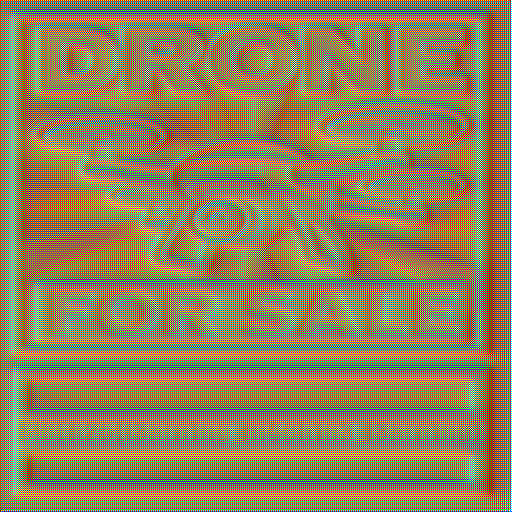
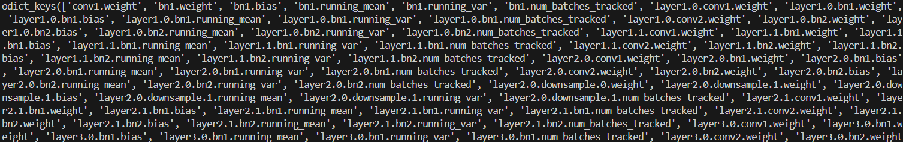

# Deep on Adversarial

#### Category: AI / ML

#### Difficulty: Medium

## Description

Recently, our AI Drone Tech Support behaved strangely. During investigation, we discovered two odd files on the culprit device are identical to a suspicious file from our server. We suspect something malicious is hidden inside the image itself, but we couldn’t see it directly. Can you figure out how to uncover what’s within the image that can only be seen by AI? 

### Preview (flag.png)



## Solution
<details>

The challenge provided two files which are `flag.png` and `model.pth`. Since image is provided, it is most likely to be Convolutional Neural Network (CNN) as the deep learning algorithm. Can read more from [here](https://ieeexplore.ieee.org/document/9859462). The model file has a `.pth` extension which also known as [PyTorch](https://medium.com/@yulin_li/what-exactly-is-the-pth-file-9a487044a36b) and it is a common way to store the learned parameters such as weights and biases of a trained model.

The challenge description contains a hint which is *"hidden inside the image itself, but we couldn’t see it directly and can be only seen by AI"*. The player should have an idea the hidden data lies in the feature maps (activations). Basically, the idea of this challenge is that the player must rebuild the CNN model correctly, feed the image through it, and inspect the intermediate activations to retrieve the hidden data.

### Identify the CNN
---

Now, the first step is to identify what type of CNN is the model using. We can create a simple script using PyTorch like this:

```python
import torch
model = torch.load("model.pth", map_location="cpu")
print(model.keys())
print(type(model))
```

The script should print the keys of the dictionaries from the model and get result like this:



From here, we should be able to identify the type of CNN used was ResNet-18. But how is it possible to know is ResNet and also not 34, 50, 101, 152? Well, the keys are a big giveaway.

The ResNet-18 architecture goes like this:


**Initial layer**: 1 convolutional layer.

**Main Layer 1**: 2 blocks, each with 2 convolutional layers = 4 layers.

**Main Layer 2**: 2 blocks, each with 2 convolutional layers = 4 layers.

**Main Layer 3**: 2 blocks, each with 2 convolutional layers = 4 layers.

**Main Layer 4**: 2 blocks, each with 2 convolutional layers = 4 layers.

**Final layer**: 1 fully connected (FC) layer.

**Total Layers: 1 + (2x2) + (2x2) + (2x2) + (2x2) + 1 = 18**

Residual blocks in each main layers for ResNet-18 are usually named like `layer1.0`, `layer1.1`, `layer2.0`, `layer2.1`, `layer3.0`, `layer3.1`,`layer4.0` and `layer4.1`. Therefore, we can confirm that this is indeed a ResNet-18.

### Rebuilding the Architecture
---

Next step is to load the model and state dictionary like this:

```python
model = models.resnet18(weights=None).to(device)
state = torch.load("model.pth", map_location=device)
model.load_state_dict(state)
```

The script basically creates an empty ResNet-18 architecture and then loads the saved parameters from `model.pth` into dictionary. Then, the weights will be copied into the model's layers. Now we should have the exact network that was used to create the adversarial image. 

### Hook function to Capture Activations
---

After that, create a forward hook function for the first convolutional layer to capture the output (activations/feature map) during forward pass process.

```python
feats = {}
def hook(m, inp, out):
    feats['f'] = out.detach().cpu()
h = model.conv1.register_forward_hook(hook)
```

### Preprocess Pipeline
---

Before forward pass, preprocessing pipeline is required because the model expects inputs in a very specific format. Normally, ResNet18 expects 224×224 RGB inputs (since it was trained on ImageNet). However, this challenge was created with a custom preprocessing pipeline that resizes the input to 512×512. To correctly reproduce the feature maps and uncover the hidden data, players must match the preprocessing steps (resize, normalize) exactly as used during creation. 

Since the challenge doesn’t provide any custom normalization values, we assume the model uses the standard preprocessing pipeline of ResNet-18 trained on ImageNet. This means applying the default ImageNet mean `[0.485, 0.456, 0.406]`and std `[0.229, 0.224, 0.225]`for normalization. We can create a function block like this:

```python
tfm = transforms.Compose([
    transforms.Resize((512, 512)),
    transforms.ToTensor(),
    transforms.Normalize(
        mean=[0.485, 0.456, 0.406],
        std=[0.229, 0.224, 0.225]
    )
])
```
Then, we have to make sure that the image is in 3-channel RGB as ResNet expects only 3 channels. We can use the `tfm()` to apply the preprocessing pipeline to the input image. We can use `.unsqueeze(0)` to ensure to add a batch dimension so the input becomes `[1, 3, H, W]` instead of `[3, H, W]`. Models in PyTorch always expect batch format.

```python
img = Image.open(args.image).convert("RGB")
    x = tfm(img).unsqueeze(0).to(device)
```

### Capture Conv1 in Forward Pass
---
After that, we run a forward pass by calling `model()`. This triggers the hook we attached earlier, which captures the activations from the first convolutional layer. Once we’ve saved the activations, we call `.remove()` on the hook so it won’t keep capturing outputs during future forward passes, since we only need the first layer for this challenge.

```python
with torch.no_grad():
    _ = model(x)
h.remove()
```
After the forward pass, the hook stores the activation tensor in feats['f']. Since it has a batch dimension, we take the first element with [0], leaving us a tensor of shape (C, H, W). Here, C is the number of channels (64 for conv1), and H, W are the spatial dimensions (256×256 in this case).

```python
feat = feats['f'][0]
    C,H,W = feat.shape
    print("Captured activation:", feat.shape)
```
The output of conv1 should be `[64, 256, 256]`, there are a total of 64 different feature maps, 256 height and 256 width. Therefore, we can extract up to 64 channels and the hidden data may be placed in one of these channels. Create a function like `save_channel()` to turn one activation map into a viewable image. ***I only save the first channel (channel 0) which is sufficient for this challenge***

```python
def save_channel(arr2d, path):
    a = arr2d.copy()
    a = a - a.min()
    if a.max() > 0:
        a = a / a.max()
    img = (a * 255).astype("uint8")
    Image.fromarray(img).save(path)

N = min(1, C)
    for ch in range(N):
        save_channel(feat[ch].numpy(), f"output/ch{ch:03d}.png")
```

The final solve script should look something like this:

### Solve Script (Python)

```python
import torch
import torchvision.models as models
import torchvision.transforms as transforms
from PIL import Image
import numpy as np
import os
import argparse

def save_channel(arr2d, path):
    """Normalize and save single activation channel as image."""
    a = arr2d.copy()
    a = a - a.min()
    if a.max() > 0:
        a = a / a.max()
    img = (a * 255).astype("uint8")
    Image.fromarray(img).save(path)

def main():
    parser = argparse.ArgumentParser()
    parser.add_argument("--model", required=True)
    parser.add_argument("--image", required=True)
    args = parser.parse_args()

    os.makedirs("output", exist_ok=True)
    device = "cuda" if torch.cuda.is_available() else "cpu"

    # 1. Load ResNet18 and state dict
    model = models.resnet18(weights=None).to(device)
    state = torch.load(args.model, map_location=device)
    model.load_state_dict(state)

    # 2. Hook into first convolution (or try later layers if needed)
    feats = {}
    def hook(m, inp, out):
        feats['f'] = out.detach().cpu()
    h = model.conv1.register_forward_hook(hook)
    

    # 3. Preprocess input
    tfm = transforms.Compose([
        transforms.Resize((512, 512)),  # must match creator side
        transforms.ToTensor(),
        transforms.Normalize(
            mean=[0.485, 0.456, 0.406],
            std=[0.229, 0.224, 0.225]
        )
    ])

    img = Image.open(args.image).convert("RGB")
    x = tfm(img).unsqueeze(0).to(device)

    # 4. Forward pass
    with torch.no_grad():
        _ = model(x)
    h.remove()

    # 5. Extract feature map
    feat = feats['f'][0]  # shape (C,H,W)
    C,H,W = feat.shape
    print("Captured activation:", feat.shape)

    # 6. Save individual channels (2 and above) OR first channel is sufficient to get the flag
    N = min(1, C)
    for ch in range(N):
        save_channel(feat[ch].numpy(), f"output/ch{ch:03d}.png")
    
if __name__ == "__main__":
    main()
```

After executing the script, we should be able to obtain the flag for this challenge.


### Flag
> SIBER25{l3arn1ng_m4ch1n3_l3arn1ng}

</details>